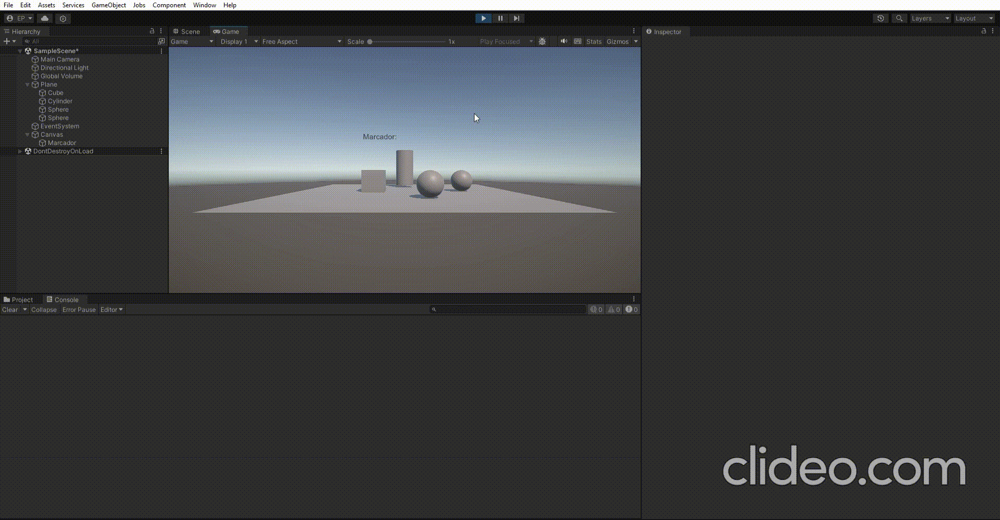

# pr4_interfaces_inteligentes
## En esta practica se han realizados escenas en las que practicamos C#, fisicas y eventos:
### ejer1: hacer cambiar de color las esferas T1 y mover hacia el cilindro las esferas T2 cuando el cubo colisiona con el cilindro

### ejer2: Cuando el cubo colisiona con cualquier objeto que no sean esferas del grupo 1, las esferas en el grupo 1 se acercan al cilindro. Cuando el cubo toca cualquier esfera del grupo 1, las esferas del grupo 2 aumentan de tamaño.

### ejer3: Cuando el cubo se aproxima al cilindro, las esferas del grupo 1 cambian su color y saltan y las esferas del grupo 2 se orientan hacia un objeto ubicado en la escena con ese propósito.

### ejer4: Implementar la mecánica de recoger esferas en la escena que actualicen la puntuación del jugador. Las esferas de tipo 1 suman 5 puntos y las esferas de tipo 2 suman 10. Mostrar la puntuación en la consola.

### ejer5: Partiendo del script anterior crea una interfaz que muestre la puntuación que va obteniendo el cubo.

### ejer6: que el cubo se mueva hacia la esfera

